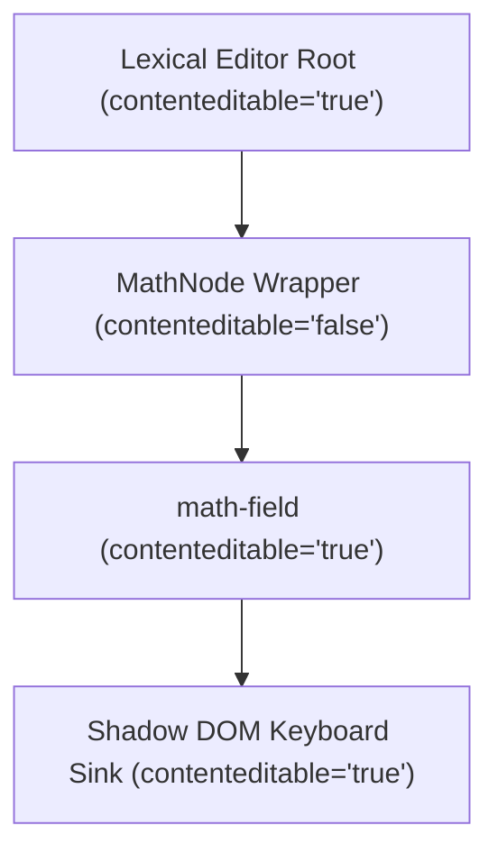

# Post-Mortem & Findings: MathLive Integration in Lexical Editor

This report details our findings, diagnoses, and final resolution for the bug where math variables (like $x$) were swallowed and rendered invisibly inside the contribution editor.

---

## 1. Executive Summary

* **Symptom:** When typing inside the `<math-field>` editor, single characters (like `x` or `y`) were swallowed entirely, rendering as empty spacers (`<span data-atom-id="..."></span>`) and registering as `""` (empty string) in MathLive's internal model. However, typing `xx` successfully triggered the inline shortcut `\times` ($\times$) and rendered the visible symbol `×`.
* **Root Cause 1 (Font Resolving):** Chrome resolved the custom `@font-face` rules by utilizing a broken or incomplete local LaTeX system font (`local("KaTeX_Math")`), skipping the network request and resulting in `0` layout dimensions.
* **Root Cause 2 (Event Interception & DOM Boundaries):** Lexical registered global `beforeinput` listeners in the **Capture Phase** at the editor root. For any standard character inputs inside the MathLive Shadow DOM, Lexical intercepted the event and called `e.preventDefault()`, cancelling text entry. Shortcuts like `xx` worked because MathLive processes shortcuts by imperatively editing its internal AST directly, bypassing the cancelled `beforeinput` event.
* **Resolution:** We established a **nested contentEditable boundary** by setting `contentEditable="false"` on the Lexical node container and `contentEditable="true"` directly on the `<math-field>` host. This tells Lexical to ignore all events inside the math block, while signaling Chrome to allow editing and character entry inside the Shadow DOM natively.

---

## 2. Deep Dive: The Swallowed Character Paradox

We observed a paradox: how could typing `x` once result in `""`, but typing `x` twice trigger `\times`?

### The Mechanics of standard inputs vs. shortcuts
* **Standard Keypress (`x` once):** MathLive waits for the browser to trigger a standard text composition flow via `beforeinput`. Because `<math-field>` was inside a contenteditable parent node without standard boundaries, the event bubbled up to Lexical's root. Lexical intercepted it, found the selection was on a DecoratorNode (which Lexical doesn't know how to edit directly), and called `e.preventDefault()`. The character was never inserted.
* **Shortcuts (`xx` -> `\times`):** MathLive listens to `keydown` to record key sequences. When you press `x` twice, the keystroke buffer holds `["x", "x"]`. MathLive recognizes this as an inline shortcut and **imperatively modifies the AST** to insert `\times`, bypassing the native browser input flow (and thus avoiding Lexical's cancelled `beforeinput`).

---

## 3. The Nested contentEditable Boundary Solution

Nesting custom shadow DOM inputs inside document editors is a known web-platform challenge. We resolved it by introducing the following DOM structure:



### Why it works:
1. **`contenteditable="false"` on the Node Wrapper:** Instructs Lexical to completely ignore all keyboard, pointer, and input events originating inside this node. Lexical's capture-phase listeners skip these events entirely.
2. **`contenteditable="true"` on the Host Element:** Informs Chrome that this sub-tree is a new editing root. Even though its parent is non-editable, the browser allows native focus, typing, and IME handling inside the nested custom element.

---

## 4. Code Changes Made

### 1. MathNode DOM Creation
Inside [MathNode.ts](file:///home/carterdeb/0-srcs/js-ts/bluelearn/app/src/components/contribute/editor/math-plugin/MathNode.ts#L52-L57), we set the wrapper to be non-editable:
```typescript
  createDOM(_config: EditorConfig): HTMLElement {
    const dom = document.createElement(this.__inline ? "span" : "div");
    dom.style.display = this.__inline ? "inline-block" : "block";
    dom.contentEditable = "false"; // Restricts Lexical event bubbling
    return dom;
  }
```

### 2. MathFieldAdapter Attribute
Inside [MathFieldAdapter.tsx](file:///home/carterdeb/0-srcs/js-ts/bluelearn/app/src/components/contribute/editor/math-plugin/MathFieldAdapter.tsx#L185-L195), we bind `contentEditable` dynamically to allow editing when not read-only:
```tsx
    return (
      <math-field
        ref={internalRef}
        onFocus={onFocus}
        onBlur={onBlur}
        onKeyDown={onKeyDown}
        onPointerDown={handlePointerDown}
        className={className}
        style={style}
        contentEditable={readOnly ? "false" : "true"} // Opens the editing root
      />
    );
```

---

## 5. Summary of Key Learnings

1. **DecoratorNode Isolation:** All interactive or input-based custom elements embedded in Lexical/MDXEditor must live inside a `contenteditable="false"` boundary.
2. **Nested Editing Roots:** When nesting web components or custom elements inside a `contenteditable="false"` parent, you must explicitly declare `contenteditable="true"` on the custom element host to allow Chrome and other browsers to process shadow DOM inputs.
3. **Capture Phase Dominance:** Ancestor elements listening in the capture phase (like Lexical's root) will always preempt descendant event blockers. Isolating via structural HTML properties (like `contenteditable`) is far more robust than attempting to manually block event propagation.
